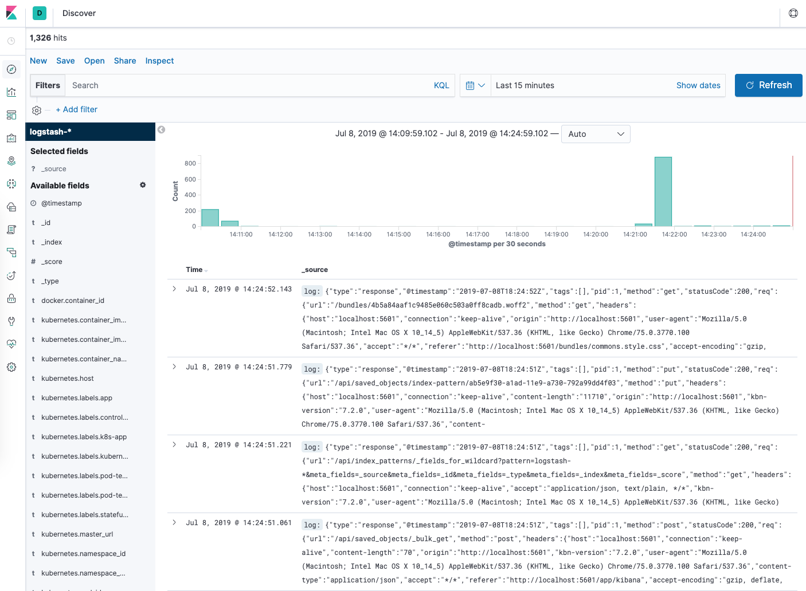

# Simple CRUD APP

### Info
This APP handleS CRUD (Create-Read-Update-Delete) of a smoothies catalog


### How to test
You may use a rest client (e.g. Insomnia) and/or check the expose API on the following URL 

[swagger-ui](http://localhost:9090/swagger-ui.html#)

Provided that app is up and running

### Coverage
After mvn clean package a folder is created under 

`target\site\jacoco`

Sited there you will find the [Jacoco](https://www.eclemma.org/jacoco/) code coverage report (index.html)

### Stress test

Check gatling folder for a stress test results

### Improvements

1) Stress/Load test


Exception handling, caching strategy, API calls safeguard


# Dockerized

### Tools and frameworks of solution

* Spring boot : a simple app that collects money exchange rates

* Redis : Used for caching retrieved money rates results 

* MySql : Basic stuff, just store when rates are retrieved (not fetched from cache)

* FluentD : Used for collecting and persist logs of application

* Elastic/Kibana: View logs

* Java: Spring boot app developed in java 11

* docker: The whole solution is "grouped" as images that can be started with docker-compose

* Maven: In order to build app

### How to build

1) cd  to MoneyExchange

```
mvn clean package
```

2) `docker build -t ex-currency .`

3) cd to docker

```
docker-compose -f elastic.yml up
docker-compose -f services.yml up
```

> In case you prefer to have app run via command line use the follwoing

1. run :  `docker-compose -f services_only.yml up`

2. run :  `env.bat` 

3. run :  `java -jar target\app.jar`

> app runs on port 9090, in case you have another service running on this port use another port with

```
java -jar target\app.jar --server.port={YOUR_FREE_PORT}
```

### How to see logs

1) Open [kibana](http://localhost:5601/)

2) Click on Discover in the left-hand navigation menu:

You should see the following configuration window:


3) This allows you to define the Elasticsearch indices you’d like to explore in Kibana. To learn more, consult Defining your index patterns in the official Kibana docs. For now, we’ll just use the logstash-* wildcard pattern to capture all the log data in our Elasticsearch cluster. Enter logstash-* in the text box and click on Next step.

You’ll then be brought to the following page:


4) This allows you to configure which field Kibana will use to filter log data by time. In the dropdown, select the @timestamp field, and hit Create index pattern.

Now, hit Discover in the left hand navigation menu.

You should see a histogram graph and some recent log entries:


